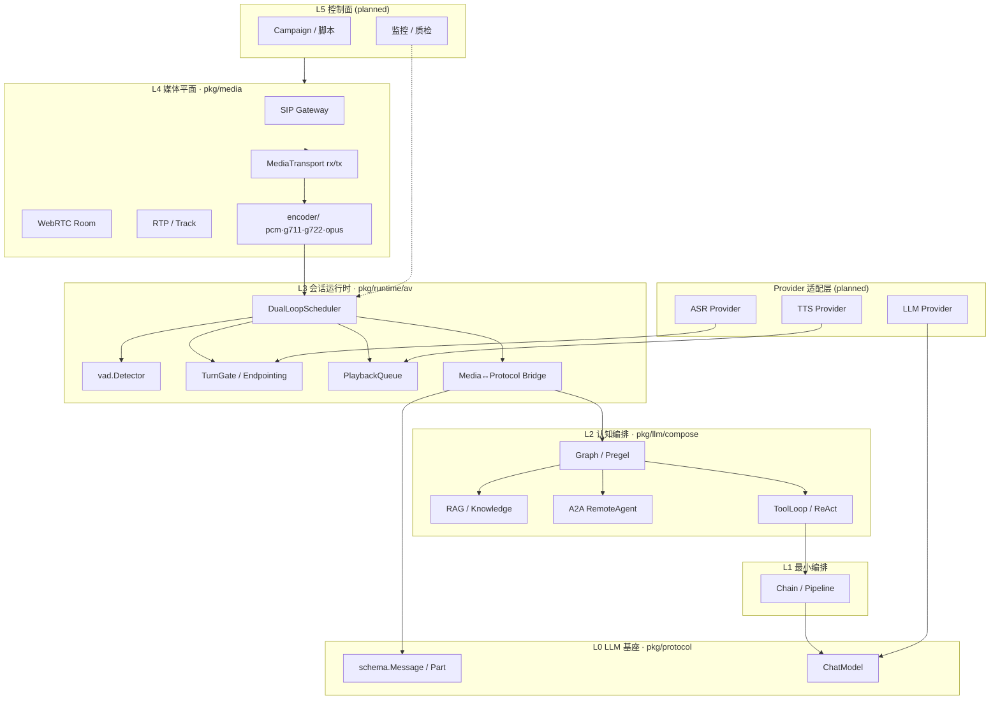
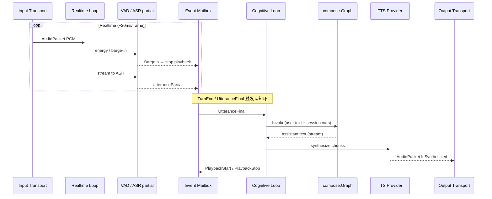
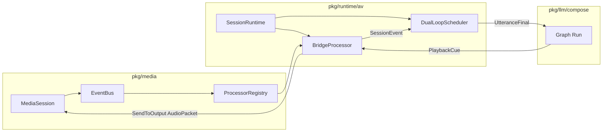
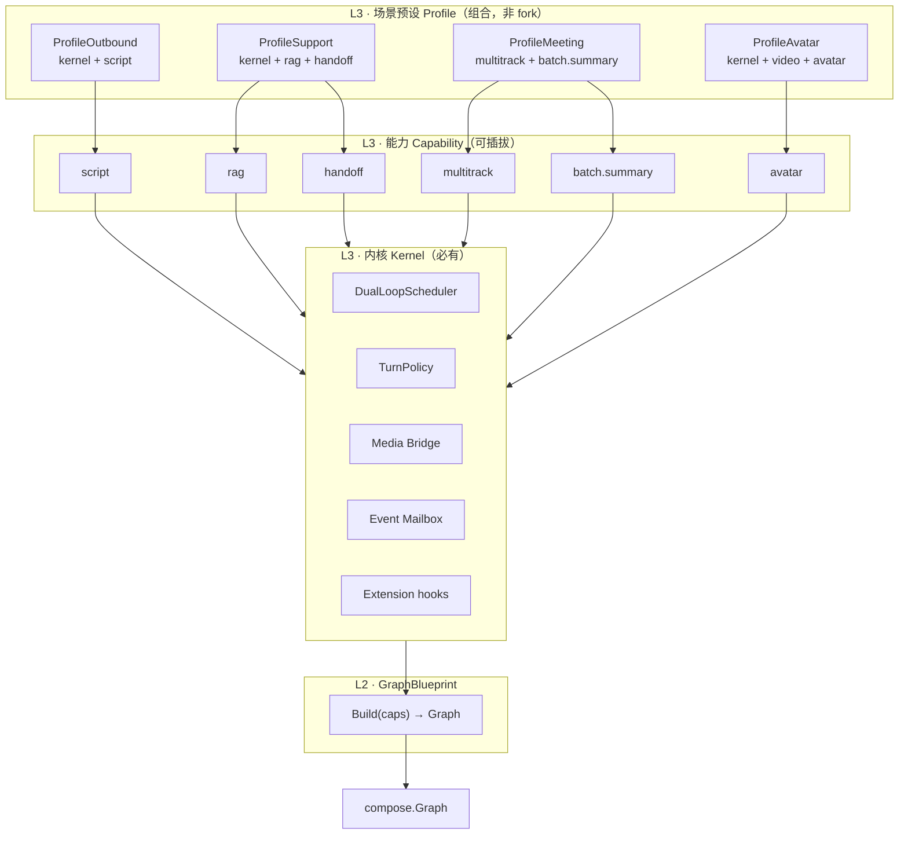

# 08 · 音视频 + LLM 编排架构

L3 语音运行时与 L4 媒体接入，通过**双环调度**与 L2 编排图（Graph/Pregel）融合，形成通用 AV+LLM 框架。

## 三平面模型



## 双环调度（核心）

实时媒体与认知推理**不同频**：前者 ms 级、后者秒级。用两条独立循环 + 邮箱协调，避免线性 pipeline 阻塞。



### 环职责

| 环 | 延迟目标 | 输入 | 输出 |
|----|----------|------|------|
| **Realtime** | &lt; 50ms | `AudioPacket` (rx) | partial ASR、`BargeIn`、VAD 状态 |
| **Cognitive** | 100ms–数秒 | `UtteranceFinal` | Graph 结果 → TTS → `PlaybackCue` |

### 邮箱事件（`pkg/protocol/media`）

| 事件 | 方向 | 说明 |
|------|------|------|
| `utterance.partial` | RT → CG | ASR 中间结果（可选展示，不触发 Graph） |
| `utterance.final` | RT → CG | 一轮用户话轮结束，触发 Graph |
| `barge_in` | RT → CG | 打断下行播放 + 取消进行中的 Graph run |
| `playback.start/stop` | CG → RT | 下行合成状态，供 VAD 门控 |
| `turn.start/end` | RT ↔ CG | 话轮边界 |

## 包映射

```
pkg/media/                  # L4：编解码、Session、EventBus、Processor、Transport
pkg/media/encoder/          # pcm, g711, g722, opus
pkg/media/vad/              # 能量 VAD / barge-in
pkg/protocol/media/         # L3 协议：Utterance, SessionEvent, PlaybackCue
pkg/runtime/av/             # L3 运行时：DualLoopScheduler, SessionRuntime, Bridge
pkg/providers/asr|tts/      # (planned) 厂商适配
pkg/llm/compose/            # L2：graph_media.go 媒体节点
cmd/voice-local-demo/       # M1：本地 fake transport + fake ASR/TTS
```

## 与现有 `MediaSession` 的衔接

`pkg/media.MediaSession` 已具备：

- **EventBus** + **ProcessorRegistry**（异步 packet/state 分发）
- **TransportManager**（rx 解码 → 事件；tx 编码 → 发送）
- **Router**（多路输出 broadcast）
- **AsyncTaskRunner**（ASR/TTS 类长任务 worker pool）

`SessionRuntime`（`pkg/runtime/av`）在其上注册 Processor，将 `TextPacket` / 状态转换为 `protocol/media.SessionEvent`，并驱动 Graph。



## 通道类型（Graph 扩展）

与 Pregel channel 对齐，媒体侧预留四类 channel：

| Channel | 合并策略 | 载荷 |
|---------|----------|------|
| `text` | Last | 用户/助手文本 |
| `event` | Append | SessionEvent 流 |
| `audio` | Append | PCM 帧（调试/录制） |
| `control` | Last | barge-in、cancel、play state |

## 里程碑

| 阶段 | 范围 | 验收 |
|------|------|------|
| **M1** | 本地 fake transport、双环、假 ASR/TTS、barge-in | `cmd/voice-local-demo` |
| **M2** | 流式 ASR/TTS Provider 接口 + 一个真实厂商 | 端到端延迟 &lt; 800ms |
| **M3** | WebRTC room/track | 浏览器双向语音 |
| **M4** | SIP dispatch + Campaign | 外呼/客服场景 |

## 依赖规则

```
L5 → L4 (media/transport) → L3 (runtime/av) → L2 (compose) → L1 → L0 (protocol)
```

`pkg/protocol/media` **不依赖** `pkg/media`，保证协议层可独立序列化（A2A、Webhook、日志）。

---

## 通用分层：内核 → 能力 → 场景预设

**不做四套实现**，只做三层组合：



### 三层职责

| 层 | 包 | 职责 | 场景是否定制 |
|----|-----|------|-------------|
| **内核** | `runtime/av` Kernel | 双环、Turn、Bridge、Extension 钩子 | 否 |
| **能力** | `protocol/media` Capability | 声明启用哪些扩展能力 | 否 |
| **预设** | `runtime/av` Profile* | 能力打包 + Turn 参数 | 仅组合 |
| **图模板** | `compose` GraphBlueprint | 按 Capability 拼装 Graph 节点 | 仅组合 |

### 场景 = 能力组合表

| 场景 | Profile | 额外 Capability | GraphBlueprint 节点 |
|------|---------|-----------------|----------------------|
| 外呼机器人 | `ProfileOutbound` | `script` | input → script → reply |
| 实时客服 | `ProfileSupport` | `rag`, `handoff` | input → rag → reply → handoff |
| 会议 Copilot | `ProfileMeeting` | `multitrack`, `batch.summary` | 无 TTS；批量 Graph 另触发 |
| 数字人 | `ProfileAvatar` | `video.downlink`, `avatar` | kernel + 视频轨 Extension |

### 扩展点（往上铺垫）

```go
// 1. 换 Turn 策略（endpoint / VAD / push-to-talk）
profile.WithTurnPolicy(myPolicy)

// 2. 加 Extension（不修改 Kernel 源码）
profile.WithExtensions(myExt)

// 3. 换 Graph 能力组合
compose.GraphBlueprint{Caps: pmedi.PresetSupport(), RAG: svc}.Build()

// 4. 运行时控制
kernel.SetHandoff(true)  // 人工接管，抑制 Graph
ctx.SetControl(pmedi.ControlScriptNext)
```

### 代码入口

| 类型 | 位置 |
|------|------|
| Capability / Preset | `pkg/protocol/media/capability.go` |
| SessionContext / Control | `pkg/protocol/media/context.go` |
| TurnPolicy 接口 | `pkg/protocol/media/turn.go` |
| Kernel / Profile | `pkg/runtime/av/kernel.go`, `profile.go` |
| Extension | `pkg/runtime/av/extension.go` |
| GraphBlueprint | `pkg/llm/compose/blueprint.go` |

Demo 切换预设：

```bash
go run ./cmd/voice-local-demo/ -preset outbound -say "您好"
go run ./cmd/voice-local-demo/ -preset support -say "查订单"
```
