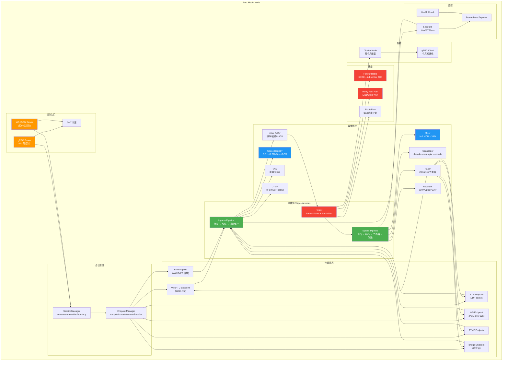
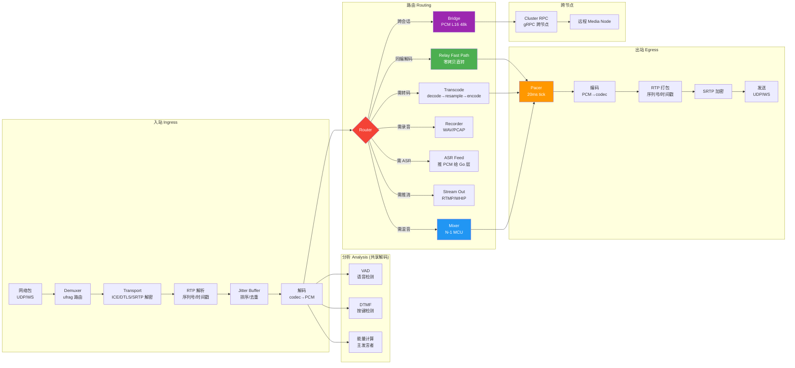
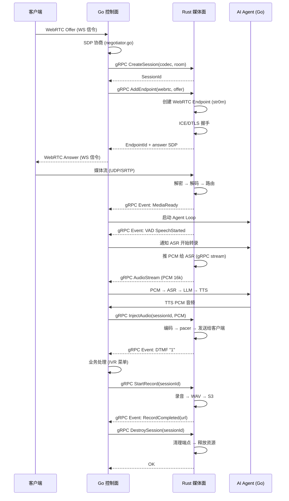
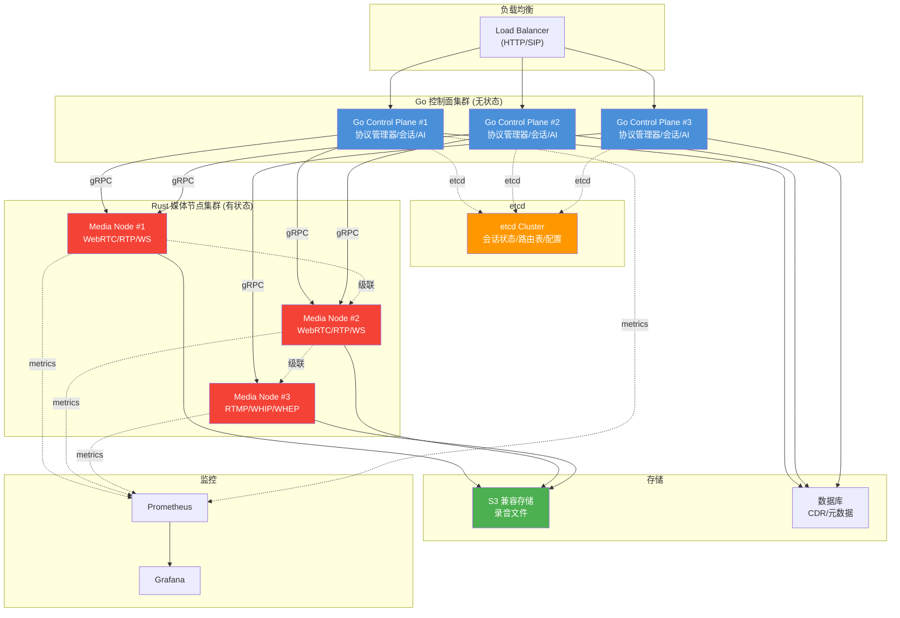
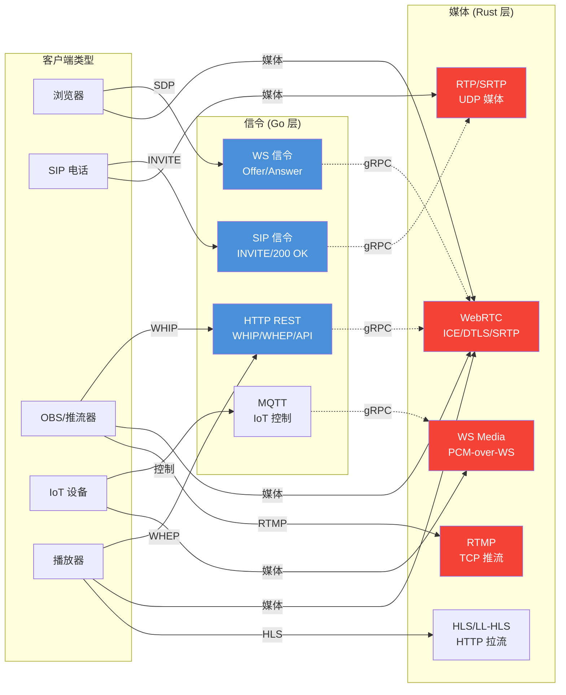

# LingVoice Rust 流媒体层架构规划

> 基于 10 个开源项目的深度分析，博采众长，为 LingVoice 的 Rust 流媒体层设计完整的功能清单和架构方案。

---

## 一、参考项目总览

| 项目 | 核心价值 | 借鉴点 |
|------|---------|--------|
| **atm0s-media-server** | 去中心化媒体服务器 | 节点分离设计、SDN 路由、多租户、Sans-IO runtime |
| **rtpbridge** | RTP 媒体路由服务器 | WS JSON 控制接口、session/endpoint 模型、转码管道、DTMF、VAD、session bridging、endpoint transfer |
| **str0m** | Sans-I/O WebRTC 库 | 纯状态机设计、frame mode vs RTP mode、单 UDP socket 多路复用、ICE-lite |
| **webrtc-rs-sfu** | Sans-I/O SFU | Sfu/Room/Client 三层 Protocol trait 组合、ufrag 编码地址复用、ForwardTable 转发 |
| **forge-media** | 载波级媒体引擎 | G.711/G.722/G.729/Opus 全编解码、会议混音+VAD+AGC、SRTP AES-GCM、AI 集成、安全加固 |
| **pulsebeam-sfu** | 高性能 SFU | thread-per-core 架构、编译路由计划、eBPF UDP steering、70ms→10ms 优化 |
| **xiu** | 流媒体协议转换 | RTMP/RTSP/WHIP/WHEP/HLS 互转、StreamHub 中央路由、GOP cache |
| **lvqr** | 统一流媒体基础设施 | 统一 Fragment 模型、chitchat gossip 集群、WASM 过滤链、零外部依赖 |
| **atm0s-media-sip-gateway** | SIP 网关 | SIP↔媒体服务器桥接、RTP offer/answer 对接、HTTP hook 机制 |
| **livekit-rust-sdks** | LiveKit Rust SDK | NativeAudioSource(TTS) vs Device(麦克风)、Simulcast/SVC/Dynacast、Room/Participant/Track 模型 |

---

## 二、功能清单

### 2.1 传输层（Transport）

| 功能 | 参考来源 | 优先级 | 说明 |
|------|---------|--------|------|
| WebRTC (ICE/DTLS/SRTP) | str0m | P0 | Sans-I/O 设计，ICE-lite 模式，单 UDP socket 多路复用 |
| RTP/SRTP (plain) | rtpbridge, forge-media | P0 | SDES key exchange，symmetric RTP，NAT 地址学习 |
| WHIP (ingest) | atm0s, xiu | P1 | HTTP POST SDP offer → answer，WebRTC 发布 |
| WHEP (egress) | atm0s, xiu | P1 | HTTP POST SDP offer → answer，WebRTC 订阅 |
| RTMP (ingest) | xiu | P2 | 推流接收，GOP cache，H.264/AAC |
| RTSP | xiu | P2 | TCP interleaved + UDP，H.264/H.265/AAC |
| WebSocket media | rtpbridge | P1 | PCM-over-WS，二进制帧，可配采样率 |
| SIP RTP | atm0s-sip-gateway | P0 | SIP 信令在 Go 层，RTP 媒体在 Rust 层 |

### 2.2 编解码层（Codec）

| 功能 | 参考来源 | 优先级 | 说明 |
|------|---------|--------|------|
| G.711 (PCMU/PCMA) | forge-media, rtpbridge | P0 | 纯 Rust 查找表，8kHz，64kbit/s |
| G.722 | forge-media, rtpbridge | P0 | ezk-g722 库，16kHz 宽带 |
| G.729 | forge-media | P2 | bcg729-sys FFI，8kHz 低比特率 |
| Opus | forge-media, rtpbridge | P0 | audiopus/opus2 FFI，8-48kHz，VoIP/Audio/LowDelay |
| L16 (PCM) | rtpbridge | P0 | 原始 PCM，桥接中间格式 |
| AAC | xiu | P2 | RTMP 流用 |
| H.264 | xiu, str0m | P1 | 视频编解码 |
| H.265 (HEVC) | xiu | P2 | RTSP/RTMP 流用 |
| VP8/VP9 | str0m, livekit | P2 | WebRTC 视频 |
| AV1 | livekit | P3 | 未来编解码 |

### 2.3 媒体处理层（Media Processing）

| 功能 | 参考来源 | 优先级 | 说明 |
|------|---------|--------|------|
| 音频转码管道 | rtpbridge, forge-media | P0 | decode→resample→encode，LRU 缓存 |
| 重采样 | forge-media, rtpbridge | P0 | 采样率转换（8k/16k/24k/48k） |
| 会议混音 (N-1 MCU) | forge-media, atm0s | P1 | mix-minus，per-participant gain，饱和钳位 |
| VAD (语音活动检测) | rtpbridge, forge-media | P1 | 能量阈值 + 可选 Silero 神经网络 VAD |
| AGC (自动增益控制) | forge-media | P2 | 自动音量调节 |
| DTMF 检测/生成 | rtpbridge, forge-media | P1 | RFC 4733 telephone-event + inband Goertzel |
| 抖动缓冲 (Jitter Buffer) | webrtc-rs-sfu, str0m | P0 | 序列号排序，去重，迟到丢弃 |
| 录音 | rtpbridge, forge-media, atm0s | P0 | WAV + Opus + PCAP，时间戳排序，S3 上传 |
| 文件播放 | rtpbridge | P1 | WAV/MP3/OGG/FLAC，seek/pause/resume，loop |
| 音频源 (TTS 注入) | livekit, rtpbridge | P0 | NativeAudioSource 手动推帧模式 |
| 低通滤波 | LingVoice Go 层 | P0 | 抗混叠 FIR，降采样前处理 |
| Comfort Noise | forge-media | P2 | RFC 3389 静音舒适噪声 |

### 2.4 路由与转发层（Routing & Forwarding）

| 功能 | 参考来源 | 优先级 | 说明 |
|------|---------|--------|------|
| 同编解码 relay (零拷贝) | LingVoice Go 层, str0m | P0 | codec 匹配时直接转发，不解码 |
| SFU 转发 (publisher→subscriber) | webrtc-rs-sfu, pulsebeam | P0 | ForwardTable，SSRC 路由，PT 转换 |
| 多订阅者 fan-out | pulsebeam, atm0s | P0 | 一对多转发，backpressure 策略 |
| 跨会话桥接 (Session Bridge) | rtpbridge | P1 | PCM L16 48kHz 中间格式，无重编码损失 |
| 端点转移 (Endpoint Transfer) | rtpbridge | P2 | 零中断端点迁移，保留 ICE/DTLS 状态 |
| 编译路由计划 | pulsebeam | P2 | 控制器编译 TrackPlan，数据面只执行 |
| 协议转换 | xiu, lvqr | P2 | RTMP↔WebRTC↔HLS 等互转 |

### 2.5 集群与分布式（Cluster）

| 功能 | 参考来源 | 优先级 | 说明 |
|------|---------|--------|------|
| 节点分离 (Gateway/Media/Connector) | atm0s | P1 | 控制面/数据面/存储分离 |
| 去中心化路由 | atm0s (SDN), lvqr (gossip) | P2 | 跨节点媒体转发 |
| 跨节点 SFU 级联 | atm0s, pulsebeam | P2 | publisher 在节点 A，subscriber 在节点 B |
| 录制存储 | atm0s (S3), forge-media | P1 | S3 兼容对象存储 |
| 多租户隔离 | atm0s | P1 | AppId + RoomId 哈希隔离 |
| 负载均衡 | pulsebeam (eBPF) | P3 | UDP 包 steering 到正确核心 |

### 2.6 控制接口（Control Plane Interface）

| 功能 | 参考来源 | 优先级 | 说明 |
|------|---------|--------|------|
| gRPC 媒体控制 | atm0s | P0 | Go 控制面 → Rust 媒体面 |
| WebSocket JSON API | rtpbridge | P1 | 每个 WS 连接 = 一个媒体会话 |
| HTTP REST (WHIP/WHEP) | atm0s, xiu | P1 | 协议适配 |
| Token 认证 (JWT) | atm0s, atm0s-sip-gateway | P0 | 多租户 token |
| HTTP Hook | atm0s-sip-gateway | P1 | 事件回调外部系统 |
| Prometheus 指标 | forge-media, pulsebeam | P0 | 指标导出 |

### 2.7 安全与监控（Security & Observability）

| 功能 | 参考来源 | 优先级 | 说明 |
|------|---------|--------|------|
| SRTP (AES-128/256-GCM) | forge-media, str0m | P0 | RFC 7714 |
| Rate Limiting | forge-media | P1 | API 速率限制 |
| SSRF 防护 | forge-media | P1 | AI 端点白名单 |
| 路径遍历防护 | forge-media | P1 | 录音目录 root-jail |
| 遥测 (atomic 指标) | LingVoice Go 层, forge-media | P0 | 全局 + per-leg 统计 |
| RTCP 监控 | str0m, forge-media | P0 | jitter/RTT/丢包率 |
| 健康检查 | forge-media | P0 | /health 端点 |

---

## 三、架构设计

### 3.1 架构选型决策

| 决策点 | 选择 | 参考项目 | 理由 |
|--------|------|---------|------|
| **WebRTC 栈** | str0m | str0m, rtpbridge, pulsebeam | Sans-I/O，生产验证，ICE-lite，RTP mode 适合 SFU |
| **并发模型** | Tokio async + Sans-IO 媒体核心 | atm0s, rtpbridge | I/O 用 Tokio，媒体处理用 Sans-IO 状态机 |
| **节点架构** | Gateway + Media Node 分离 | atm0s | 控制面/数据面分离，可独立扩展 |
| **集群协调** | etcd (Go 层) + gRPC (Rust 层) | atm0s, LingVoice 设计 | etcd 已在 Go 层，Rust 层通过 gRPC 接受调度 |
| **控制接口** | gRPC (主) + WS JSON (辅) | atm0s, rtpbridge | gRPC 用于 Go→Rust 控制，WS JSON 用于客户端直接控制 |
| **编解码** | 纯 Rust + FFI 混合 | forge-media, rtpbridge | G.711 纯 Rust，Opus/G.722 FFI |
| **路由模型** | 编译路由计划 + 运行时执行 | pulsebeam | 控制器编译 plan，数据面只执行，低延迟 |
| **Fragment 模型** | 不采用统一 Fragment | lvqr (反例) | LingVoice 是实时通信为主，不是流媒体分发 |
| **thread-per-core** | 后期优化 | pulsebeam | 初期用 Tokio，性能不够再迁移 TPC |

### 3.2 Crate 划分

```
rust-media/
├── Cargo.toml (workspace)
│
├── crates/
│   ├── lm-core/              # 核心类型、traits、配置
│   │   ├── codec.rs          # AudioCodec trait, AudioFormat, CodecType
│   │   ├── packet.rs         # RtpPacket, MediaFrame, AudioFrame
│   │   ├── session.rs        # SessionId, RoomId, PeerId, TrackId
│   │   ├── config.rs         # 全局配置
│   │   └── error.rs          # 统一错误类型
│   │
│   ├── lm-transport/         # 传输层抽象
│   │   ├── lib.rs            # Transport trait (Sans-IO)
│   │   ├── webrtc.rs         # WebRTC transport (基于 str0m)
│   │   ├── rtp.rs            # Plain RTP/SRTP transport
│   │   ├── ws.rs             # WebSocket media transport
│   │   ├── rtmp.rs           # RTMP transport
│   │   └── endpoint.rs       # Endpoint 抽象 (参考 rtpbridge)
│   │
│   ├── lm-codecs/            # 编解码器
│   │   ├── g711.rs           # G.711 A-law/μ-law (纯 Rust 查表)
│   │   ├── g722.rs           # G.722 (ezk-g722)
│   │   ├── g729.rs           # G.729 (bcg729-sys, 可选)
│   │   ├── opus.rs           # Opus (audiopus/opus2)
│   │   ├── pcm.rs            # L16 PCM
│   │   ├── h264.rs           # H.264 (视频)
│   │   └── registry.rs       # 编解码器注册表
│   │
│   ├── lm-dsp/               # 数字信号处理
│   │   ├── resampler.rs      # 重采样器
│   │   ├── lowpass.rs        # 低通滤波器 (FIR)
│   │   ├── vad.rs            # VAD (能量阈值 + 可选 Silero)
│   │   ├── agc.rs            # 自动增益控制
│   │   └── dtmf.rs           # DTMF 检测/生成 (RFC 4733 + inband)
│   │
│   ├── lm-mixer/             # 音频混音
│   │   ├── mixer.rs          # N-1 MCU 混音器
│   │   ├── participant.rs    # 参与者缓冲
│   │   └── dominant_speaker.rs # 主发言者检测
│   │
│   ├── lm-jitter/            # 抖动缓冲
│   │   ├── buffer.rs         # 环形缓冲，序列号排序
│   │   └── nack.rs           # NACK 重传请求
│   │
│   ├── lm-recorder/          # 录音
│   │   ├── wav.rs            # WAV 写入 (hound)
│   │   ├── opus.rs           # Opus 录音 (可选)
│   │   ├── pcap.rs           # PCAP 录音 (参考 rtpbridge)
│   │   └── storage.rs        # S3/本地存储
│   │
│   ├── lm-router/            # 媒体路由
│   │   ├── forward.rs        # ForwardTable (参考 webrtc-rs-sfu)
│   │   ├── relay.rs          # 同编解码零拷贝 relay
│   │   ├── plan.rs           # 编译路由计划 (参考 pulsebeam)
│   │   └── bridge.rs         # 跨会话桥接 (参考 rtpbridge)
│   │
│   ├── lm-pipeline/          # 媒体管线
│   │   ├── ingress.rs        # 入站管线 (decode → jitter → route)
│   │   ├── egress.rs         # 出站管线 (mix → encode → send)
│   │   ├── subscriber.rs     # EgressSubscriber trait (多订阅者)
│   │   └── pacer.rs          # ptime 节奏器 (20ms tick)
│   │
│   ├── lm-cluster/           # 集群
│   │   ├── node.rs           # 节点管理
│   │   ├── rpc.rs            # gRPC 跨节点通信
│   │   └── cascade.rs        # 跨节点 SFU 级联
│   │
│   ├── lm-control/           # 控制接口
│   │   ├── grpc.rs           # gRPC server (Go→Rust 控制)
│   │   ├── ws_json.rs        # WS JSON API (客户端直接控制)
│   │   ├── token.rs          # JWT token 认证
│   │   └── hook.rs           # HTTP hook 回调
│   │
│   ├── lm-telemetry/         # 遥测
│   │   ├── metrics.rs        # Prometheus 指标
│   │   ├── leg_stats.rs      # per-leg 统计 (jitter/RTT/loss)
│   │   └── health.rs         # 健康检查
│   │
│   └── lm-security/          # 安全
│       ├── rate_limit.rs     # 速率限制
│       ├── ssrf.rs           # SSRF 防护
│       └── path_guard.rs     # 路径遍历防护
│
├── proto/                    # gRPC protobuf 定义
│   ├── media_node.proto      # 媒体节点服务
│   ├── session.proto         # 会话管理
│   └── cluster.proto         # 集群管理
│
└── bin/
    ├── media-node/           # 独立媒体节点
    └── gateway/              # 独立网关节点 (可选)
```

### 3.3 核心 Trait 设计

```rust
// === 传输层 ===
// 参考: atm0s Transport trait + str0m Sans-IO
pub trait Transport: Send {
    fn on_tick(&mut self, now: Instant);
    fn on_input(&mut self, now: Instant, input: TransportInput);
    fn on_shutdown(&mut self, now: Instant);
    fn poll_output(&mut self) -> Option<TransportOutput>;
    fn state(&self) -> TransportState;
}

// === 编解码 ===
// 参考: forge-media AudioCodec trait
pub trait AudioCodec: Send + Sync {
    fn name(&self) -> &str;
    fn native_format(&self) -> AudioFormat;
    fn encode(&mut self, pcm: &[i16]) -> Result<Vec<u8>>;
    fn decode(&mut self, encoded: &[u8]) -> Result<Vec<i16>>;
    fn frame_size(&self) -> Option<usize>;
}

// === 媒体管线订阅者 ===
// 参考: LingVoice docs/07
pub trait EgressSubscriber: Send + Sync {
    fn on_frame(&mut self, frame: &EgressFrame) -> Result<()>;
    fn backpressure(&self) -> Backpressure;
    fn kind(&self) -> SubscriberKind;
}

pub enum Backpressure {
    Block,       // 阻塞等待（录音）
    DropOldest,  // 丢最旧的（ASR/推流）
    DropNewest,  // 丢最新的（实时通信）
}

pub enum SubscriberKind {
    Relay,       // 零拷贝直转
    Transcode,   // 转码
    Recorder,    // 录音
    AsrFeed,     // 推 PCM 给 ASR
    StreamOut,   // 推流 RTMP/WHIP
    Mixer,       // 混音
}

// === 端点 ===
// 参考: rtpbridge Endpoint
pub struct Endpoint {
    id: EndpointId,
    transport: Box<dyn Transport>,
    direction: Direction,  // SendRecv / SendOnly / RecvOnly / Inactive
    codec: CodecConfig,
    // 分析器 (共享解码，避免冗余)
    vad: Option<VadMonitor>,
    dtmf: Option<DtmfProcessor>,
}

// === 路由计划 ===
// 参考: pulsebeam TrackPlan
pub struct RoutePlan {
    local_dests: Vec<EndpointId>,      // 本地目标
    remote_dests: Vec<RemoteRoute>,    // 跨节点目标
    relay_fast_path: bool,             // 同编解码直转
}
```

---

## 四、Mermaid 架构图

### 4.1 整体架构（Go 控制面 + Rust 媒体面）

```mermaid
graph TB
    subgraph "客户端"
        Browser["🌐 浏览器<br/>WebRTC/WS"]
        Phone["📞 SIP 电话<br/>RTP"]
        OBS["📹 OBS/推流器<br/>RTMP/WHIP"]
        MobileApp["📱 移动端<br/>WebRTC/WS"]
    end

    subgraph "Go 控制面 (信令 + Agent)"
        ProtocolMgr["协议管理器<br/>pkg/protocol/manager.go"]
        WS["WS 信令<br/>SDP/ICE 协调"]
        SIP["SIP 业务<br/>鉴权/路由/转接"]
        API["REST API<br/>业务控制"]
        MQTT["MQTT<br/>IoT 控制"]

        SessionMgr["会话管理器<br/>Session/Room/Call"]
        AgentLoop["AI 编排<br/>ASR→LLM→TTS"]
        PluginSys["插件系统<br/>registry/loader/rpc"]
        DistCoord["分布式协调<br/>etcd/调度/多租户"]

        ProtocolMgr --> WS
        ProtocolMgr --> SIP
        ProtocolMgr --> API
        ProtocolMgr --> MQTT
        ProtocolMgr --> SessionMgr
        SessionMgr --> AgentLoop
        SessionMgr --> PluginSys
        DistCoord --> SessionMgr
    end

    subgraph "gRPC 契约边界"
        GrpcProto["gRPC MediaNode Service<br/>CreateSession / AddEndpoint<br/>RemoveEndpoint / StartRecord<br/>StartMix / Bridge / Transfer"]
    end

    subgraph "Rust 媒体面"
        subgraph "传输层"
            WebRTC["WebRTC Transport<br/>(str0m: ICE/DTLS/SRTP)"]
            RTP["RTP/SRTP Transport<br/>(plain + SDES)"]
            WSMedia["WS Media Transport<br/>(PCM-over-WS)"]
            RTMP["RTMP Transport<br/>(推流接收)"]
            WHIP["WHIP/WHEP<br/>(HTTP SDP 交换)"]
        end

        subgraph "媒体处理层"
            Codecs["编解码器<br/>G.711/G.722/Opus/PCM"]
            DSP["DSP<br/>重采样/低通/VAD/AGC"]
            Mixer["混音器<br/>N-1 MCU"]
            Jitter["抖动缓冲<br/>排序/去重/NACK"]
            DTMF["DTMF<br/>RFC4733+Inband"]
            Recorder["录音<br/>WAV/Opus/PCAP"]
        end

        subgraph "路由层"
            Router["媒体路由器<br/>ForwardTable + Relay"]
            Pipeline["媒体管线<br/>Ingress→Route→Egress"]
            Bridge["会话桥接<br/>PCM L16 48k"]
        end

        subgraph "集群层"
            Cluster["集群管理<br/>跨节点级联"]
            Storage["存储<br/>S3/本地"]
        end

        subgraph "控制接口"
            GrpcServer["gRPC Server<br/>接收 Go 层指令"]
            WsJson["WS JSON API<br/>客户端直接控制"]
            Token["JWT 认证<br/>多租户"]
        end

        subgraph "监控"
            Telemetry["遥测<br/>Prometheus"]
            Health["健康检查"]
        end

        WebRTC --> Pipeline
        RTP --> Pipeline
        WSMedia --> Pipeline
        RTMP --> Pipeline
        WHIP --> Pipeline

        Pipeline --> Codecs
        Pipeline --> DSP
        Pipeline --> Jitter
        Pipeline --> Router
        Router --> Mixer
        Router --> Bridge
        Router --> Recorder
        Pipeline --> DTMF

        GrpcServer --> Pipeline
        WsJson --> Pipeline
        Token --> GrpcServer
        Token --> WsJson

        Pipeline --> Telemetry
        Pipeline --> Health
        Recorder --> Storage
        Router --> Cluster
    end

    Browser -.->|WebRTC/WS 信令| WS
    Phone -.->|SIP 信令| SIP
    OBS -.->|RTMP/WHIP| API
    MobileApp -.->|WebRTC/WS| WS

    Browser ==>|WebRTC 媒体| WebRTC
    Phone ==>|RTP 媒体| RTP
    OBS ==>|RTMP/WHIP 媒体| RTMP
    MobileApp ==>|WS 媒体| WSMedia

    SIP -.->|gRPC: CreateSession| GrpcServer
    WS -.->|gRPC: AddEndpoint| GrpcServer
    API -.->|gRPC: StartRecord| GrpcServer
    SessionMgr -.->|gRPC: Bridge/Transfer| GrpcServer

    style ProtocolMgr fill:#4a90d9,color:#fff
    style SessionMgr fill:#4a90d9,color:#fff
    style AgentLoop fill:#7b68ee,color:#fff
    style GrpcProto fill:#ff9800,color:#fff
    style GrpcServer fill:#ff9800,color:#fff
    style Pipeline fill:#f44336,color:#fff
    style Router fill:#f44336,color:#fff
    style WebRTC fill:#4caf50,color:#fff
    style Codecs fill:#4caf50,color:#fff
    style Mixer fill:#4caf50,color:#fff
```



### 4.2 Rust 媒体节点内部架构



### 4.3 媒体管线数据流



### 4.4 Go ↔ Rust 控制面交互



### 4.5 集群部署架构



### 4.6 协议适配矩阵



---

## 五、实施路线图

### Phase 1: 基础设施 (P0)

**目标**: 单节点 Rust 媒体面，Go 控制面通过 gRPC 控制

1. 创建 `rust-media/` workspace + crate 骨架
2. 实现 `lm-core` 核心类型和 trait
3. 实现 `lm-codecs` (G.711 + Opus + PCM)
4. 实现 `lm-transport` WebRTC (基于 str0m)
5. 实现 `lm-transport` RTP/SRTP
6. 实现 `lm-jitter` 抖动缓冲
7. 实现 `lm-router` 基础转发 + relay fast path
8. 实现 `lm-pipeline` Ingress/Egress
9. 实现 `lm-control` gRPC server
10. 定义 `proto/media_node.proto`
11. Go 层: 修改 `negotiator.go` 桥接到 Rust
12. 验证: WS → WebRTC 基本通话

### Phase 2: 媒体处理 (P0-P1)

**目标**: 完整的媒体处理能力

1. 实现 `lm-dsp` (重采样 + 低通 + VAD)
2. 实现 `lm-dsp` DTMF (RFC 4733)
3. 实现 `lm-recorder` (WAV + PCAP)
4. 实现 `lm-mixer` N-1 MCU
5. 实现 `lm-codecs` G.722
6. 实现 `lm-router` 跨会话桥接
7. 实现 `lm-telemetry` Prometheus
8. 实现 `lm-pipeline` ptime 节奏器 + 多订阅者
9. 验证: SIP 通话 + 录音 + 混音会议

### Phase 3: 协议扩展 (P1)

**目标**: 支持所有协议适配器

1. 实现 `lm-transport` WS media
2. 实现 `lm-transport` WHIP/WHEP
3. 实现 `lm-transport` RTMP (基于 xiu 参考)
4. 实现 `lm-control` WS JSON API
5. 实现 `lm-control` JWT token 认证
6. 实现 `lm-security` (rate limit + SSRF)
7. 验证: WHIP 推流 + WHEP 拉流 + RTMP 接收

### Phase 4: 集群 (P2)

**目标**: 分布式部署

1. 实现 `lm-cluster` 节点管理
2. 实现 `lm-cluster` gRPC 跨节点通信
3. 实现 `lm-cluster` 跨节点 SFU 级联
4. 实现 `lm-recorder` S3 存储
5. Go 层: etcd 调度 + 多租户
6. 验证: 跨节点会议 + 分布式录音

### Phase 5: 性能优化 (P3)

**目标**: 极致性能

1. 评估 thread-per-core 迁移 (参考 pulsebeam)
2. 编译路由计划 (参考 pulsebeam)
3. eBPF UDP steering (Linux)
4. 零拷贝优化
5. 对象池 / buffer 复用
6. 验证: P99.99 < 10ms

---

## 六、Go 层改造要点

### 保留不变
- `pkg/protocol/common/types.go` — 统一抽象
- `pkg/protocol/manager.go` — 协议管理器
- `pkg/protocol/api/server.go` — REST API
- `pkg/protocol/ws/server.go` — WS 信令部分
- `pkg/protocol/media/negotiator.go` — 修改桥接目标

### 修改桥接
- `pkg/protocol/media/negotiator.go`: 从 Go encoder registry → gRPC 调用 Rust
- `pkg/protocol/sip/server.go`: SIP 信令保留，RTP 媒体委托 Rust
- `pkg/protocol/webrtc/server.go`: SDP/ICE 协调保留，PeerConnection 委托 Rust

### 新增
- `pkg/media/client/` — Rust 媒体面 gRPC 客户端
- `pkg/media/bridge.go` — Go media 层 → Rust media 层桥接

### 逐步废弃
- `pkg/media/session.go` — Rust 接管
- `pkg/media/router.go` — Rust 接管
- `pkg/media/mixer.go` — Rust 接管
- `pkg/media/jitter.go` — Rust 接管
- `pkg/media/recorder.go` — Rust 接管
- `pkg/media/encoder/` — Rust 接管
- 其他 media 模块 — Rust 接管

**注意**: Go 层 media 代码不立即删除，作为 fallback 和对照参考，待 Rust 层验证通过后逐步移除。
