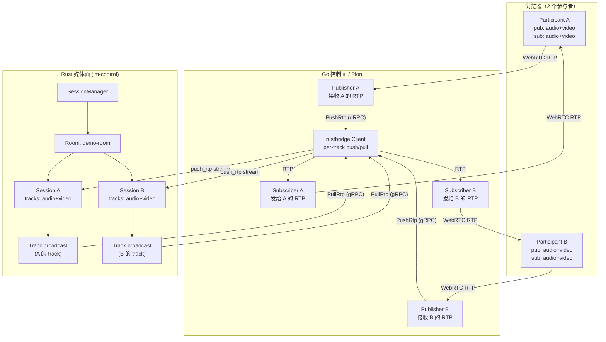
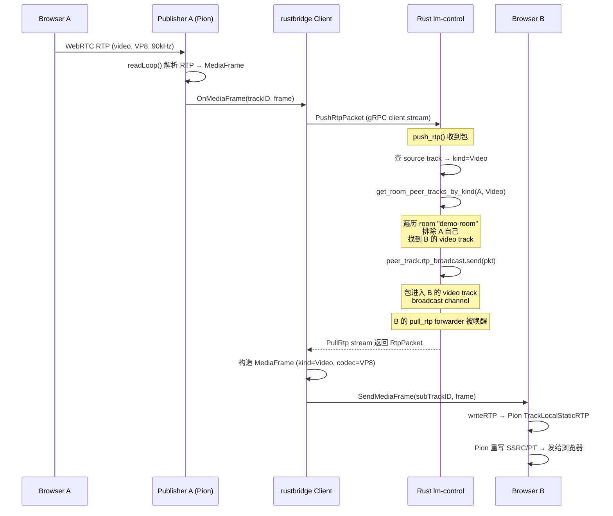
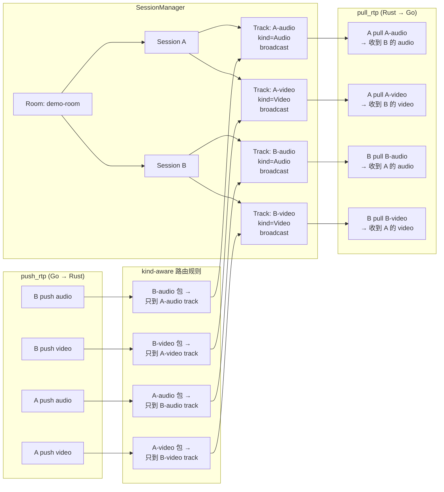
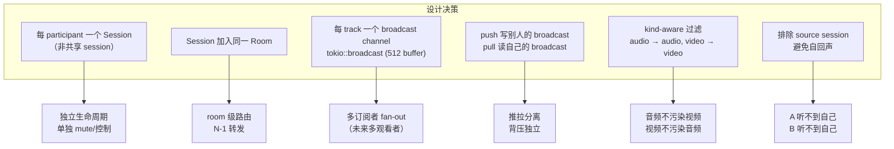
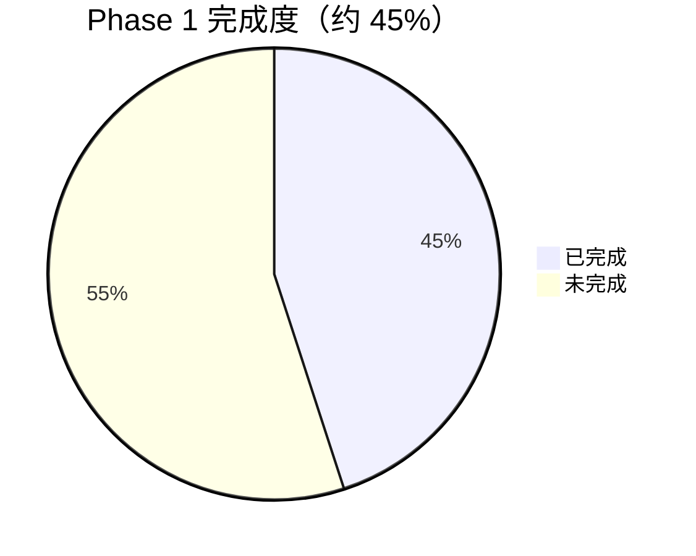
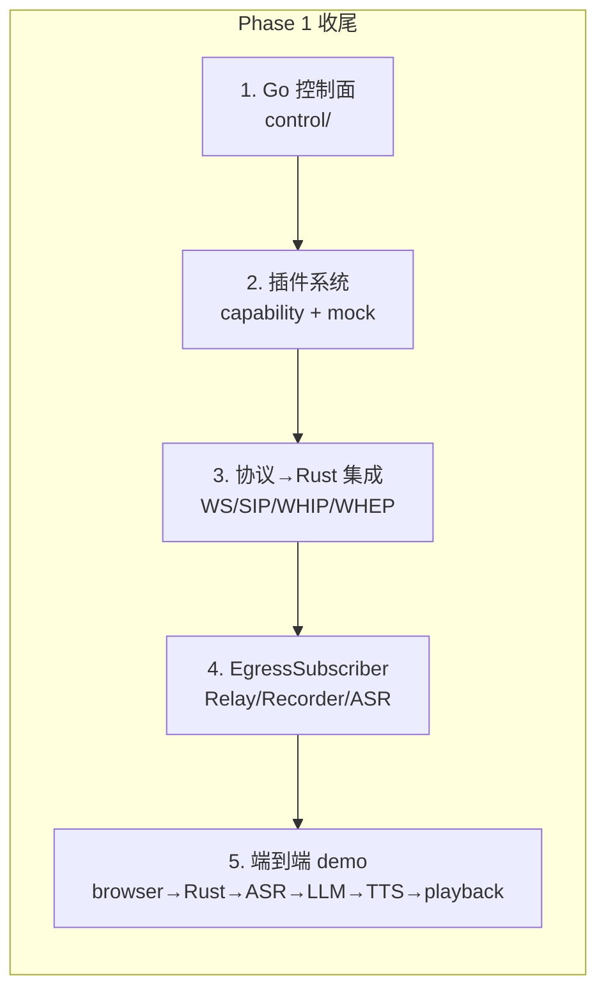

# 当前流转状态与后续路线

> 本文档记录截至 2026-08-25 的实际实现状态、媒体流转路径、各协议接入情况，以及后续开发路线。

---

## 1. 整体架构（当前实际）

---

## 2. 单个 RTP 包的完整流转（以 A 的视频包为例）

---

## 3. Rust 内部路由机制

---

## 4. 关键设计决策

---

## 5. 各协议接入状态

| 协议 | 信令实现 | Demo | Rust 媒体集成 | 端到端媒体流 | 状态 |
|------|---------|------|-------------|------------|------|
| **WebRTC** | ✅ Pion 完整 | ✅ webrtc-rust-demo | ✅ rustbridge push/pull | ✅ 音频+视频 | **跑通** |
| **WebSocket** | ✅ offer/answer/start/stop + chat | ✅ ws-rust-demo | ✅ rustbridge push/pull | ✅ 音频 + 文本 | **跑通** |
| **SIP** | ✅ sipgo (INVITE/BYE/REGISTER) | ✅ protocol-server | ❌ | ❌ | 信令通，无 RTP |
| **RTMP** | ✅ gortmplib (publish/play) | ✅ protocol-server | ❌ | ❌ | 信令通，无媒体 |
| **WHIP** | ✅ Pion (POST/DELETE) | ✅ protocol-server | ❌ | ❌ | 信令通，无媒体 |
| **WHEP** | ✅ Pion (POST/DELETE) | ✅ protocol-server | ❌ | ❌ | 信令通，无媒体 |
| **MQTT** | ✅ paho (signal/media topic) | ✅ protocol-server | ❌ | ❌ | 信令通，无媒体 |
| **REST API** | ✅ session CRUD | ✅ protocol-server | ❌ | N/A | 管理面通 |

**结论：WebRTC 和 WebSocket 已跑通端到端媒体流（Go↔Rust）。其余协议的信令层都已实现，但媒体帧未接入 Rust 媒体节点。**

### 协议适用场景

| 协议 | 音频 | 视频 | 文本 | 适用场景 |
|------|:----:|:----:|:----:|---------|
| **WebRTC** | ✅ | ✅ | ❌ (需 DataChannel) | 浏览器实时音视频通话 |
| **WebSocket** | ✅ | ❌ | ✅ | 语音 Agent + 文本交互（低复杂度接入） |
| **SIP** | ✅ | ✅ | ❌ | 传统电话互通、SIP 外呼 |
| **RTMP** | ✅ | ✅ | ❌ | 直播推流/拉流 |
| **WHIP** | ✅ | ✅ | ❌ | WebRTC 推流入站 |
| **WHEP** | ✅ | ✅ | ❌ | WebRTC 拉流出站 |
| **MQTT** | ✅ | ❌ | ✅ | IoT 设备语音接入 |

> **WebSocket 不适合传视频**：基于 TCP，无拥塞控制/带宽估计，视频关键帧（几十 KB）会导致队头阻塞和累积延迟。实时视频应使用 WebRTC / WHIP / WHEP（基于 UDP + SRTP）。WS 协议层虽保留了 video 帧定义，但仅用于协议完整性，不推荐用于实时视频传输。

---

## 6. 当前完成度 vs 计划

| 模块 | 状态 | 说明 |
|------|------|------|
| Rust 媒体基础 (10 crates) | ✅ | core/transport/codecs/router/pipeline/mixer/recorder/dsp/control/telemetry |
| gRPC 控制面 (lm-control) | ✅ | session/room/track CRUD + push/pull RTP + kind-aware 路由 |
| Go 协议层 (信令) | ✅ | 7 种协议 adapter 全部实现 |
| Go↔Rust 桥接 (rustbridge) | ✅ | per-track push/pull，已修复 pull stream map 泄漏 |
| WebRTC 端到端 demo | ✅ | 音频+视频双向 room 路由 |
| WebSocket 端到端 demo | ✅ | 音频+文本，WS 协议加 chat 消息类型 |
| audio-codec vendor | ✅ | 源码内嵌，不再依赖 crates.io |
| 单元测试 | ✅ | Rust 18 + Go 40 = 58 tests |
| **Go 控制面 `control/`** | ❌ | 无 AgentSession/TurnManager/AgentLoop |
| **插件系统** | ❌ | 无 ASR/TTS/LLM 接口、无 registry、无 mock 插件 |
| **协议→Rust 媒体集成** | ❌ | 仅 WebRTC + WebSocket，其余 5 种协议未接 |
| **EgressSubscriber fan-out** | ❌ | trait 定义了但无具体实现 |
| **协议业务逻辑** | ❌ | 无 auth/router/transfer |

---

## 7. 后续路线

### Phase 1 收尾（近期）

**优先级排序：**

1. **Go 控制面 `control/`** — P0
   - `control/session.go` — AgentSession 生命周期管理
   - `control/orchestrate.go` — AgentLoop + TurnManager + barge-in
   - `control/protocol/` — 协议 Event 上报到控制面，做业务决策（auth/router/transfer）

2. **插件系统** — P0
   - `control/capability.go` — ASR/TTS/LLM/Recorder/Detector 接口定义
   - `control/plugin/registry.go` — 插件注册 + YAML 配置加载
   - `cmd/mock-asr/`、`cmd/mock-tts/`、`cmd/mock-llm/` — Mock 插件实现

3. **协议→Rust 媒体集成** — P1
   - WebSocket → rustbridge（最简单，已有 conversation-demo 基础）
   - WHIP/WHEP → rustbridge（Pion 已有，模式与 WebRTC 一致）
   - SIP → rustbridge（需要 RTP bridge，sipgo 不处理媒体）

4. **EgressSubscriber 实现** — P1
   - RelaySubscriber — 零拷贝 RTP 转发（当前 demo 的 Rust 路由是雏形）
   - RecorderSubscriber — 接 lm-recorder
   - AsrSubscriber — 接插件 ASR

5. **端到端 demo** — P1
   - browser → Go/Pion → Rust → VAD → mock ASR → mock LLM → mock TTS → playback + barge-in

### Phase 2（中期）

| 项目 | 说明 |
|------|------|
| 视频编解码 | VP8/H.264 encoder/decoder（当前只透传 RTP payload） |
| SRTP/DTLS | Rust 侧原生 WebRTC 媒体面（或继续依赖 Pion） |
| Jitter buffer | lm-pipeline 中加自适应抖动缓冲 |
| SIP 通话 | SIP INVITE → Rust RTP → WebRTC 混音 |
| 录制 | RecorderSubscriber → WAV/MP4 落盘 |
| 会议混音 | lm-mixer 接入 EgressPipeline |

### Phase 3+（远期）

| 项目 | 说明 |
|------|------|
| 分布式 | etcd 注册 + 多节点调度 + SFU 级联 |
| RTMP 推流 | RTMP ingest → Rust → WebRTC 播放 |
| 多租户 | tenant 隔离 + 配额 + 计费 |
| 进程外插件 | gRPC sidecar 插件框架 |
| 真实 AI 插件 | OpenAI ASR/TTS、其他 LLM 接入 |

---

## 8. 推拉流模型说明

当前 Rust 部分本质是**推拉流模型**：

| 环节 | 实现 |
|------|------|
| **推 (push)** | Go 每个 publisher track 开一个 gRPC client stream (`PushRtp`)，持续把 RTP 发给 Rust |
| **Rust 路由** | 收到包后查 source track 的 kind → 找同 room 其他 session 的同 kind track → `broadcast.send()` |
| **拉 (pull)** | Go 每个 publisher track 开一个 gRPC server stream (`PullRtp`)，Rust 的 forwarder 从 broadcast channel 读包发回 Go |
| **写回浏览器** | Go 把收到的 RTP 通过 `TrackLocalStaticRTP.WriteRTP()` 写入 subscriber track，Pion 重写 SSRC/PT 后发给浏览器 |

**核心枢纽是 broadcast channel**：push 写入别人的 channel，pull 从自己的 channel 读。这天然支持未来多订阅者（一个 track 可以有多个 broadcast receiver）。
