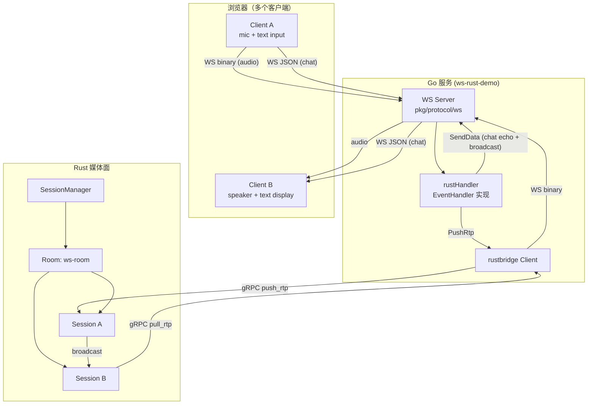
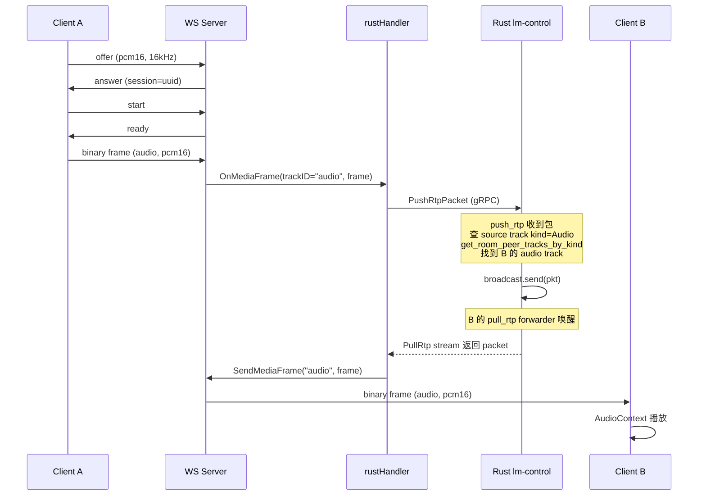
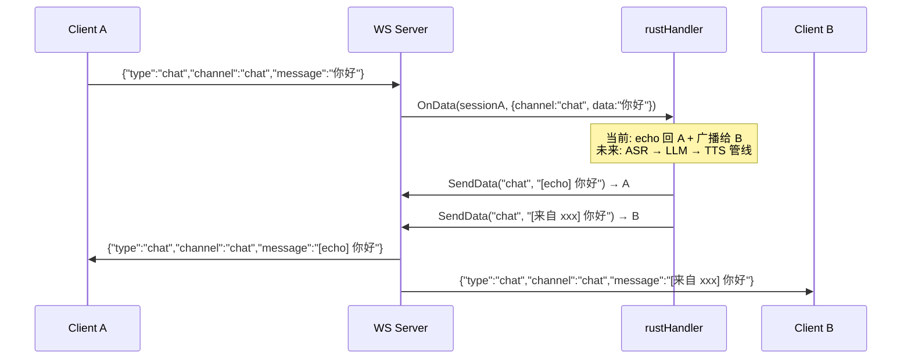

# WebSocket 协议与 Demo

> 本文档介绍 LingVoice 的 WebSocket 语音协议设计、消息格式、以及 `ws-rust-demo` 的完整链路。

---

## 1. 协议概述

WebSocket 协议是 LingVoice 七大协议适配器之一，定位为**轻量级浏览器/客户端语音接入**，无需 WebRTC 的 ICE/DTLS 复杂性，适合：

- 语音 Agent 前端（浏览器录音 → 服务端处理 → 回放）
- 实时聊天 + 语音混合场景
- 移动端 / 低功耗设备接入
- 开发调试（比 WebRTC 更简单，容易构造测试帧）

### 与 WebRTC 的区别

| 特性 | WebSocket | WebRTC |
|------|-----------|--------|
| 传输 | TCP（WebSocket） | UDP（SRTP/DTLS） |
| 信令 | 自定义 JSON | SDP Offer/Answer + ICE |
| 媒体格式 | 二进制帧（8 字节头 + payload） | RTP 包 |
| 编解码协商 | JSON offer/answer | SDP a=rtpmap |
| 浏览器 API | WebSocket + getUserMedia | RTCPeerConnection |
| 复杂度 | 低 | 高（ICE/STUN/TURN） |
| 延迟 | TCP 级别（~20-50ms） | UDP 级别（~5-20ms） |

---

## 2. 消息协议

### 2.1 协商阶段（JSON 文本消息）

```
Client → Server: OfferMessage   (声明支持的编解码列表)
Server → Client: AnswerMessage  (选定编解码 + 分配 sessionID)
Client → Server: StartMessage   (客户端准备就绪)
Server → Client: ReadyMessage   (服务端准备就绪，可以开始发媒体)
```

#### Offer（客户端 → 服务端）

```json
{
  "type": "offer",
  "version": 1,
  "session": "optional-existing-session-id",
  "media": {
    "audio": {
      "codecs": ["pcm16", "opus", "pcmu", "pcma"],
      "sampleRates": [16000, 48000, 8000],
      "channels": [1, 2]
    },
    "video": {
      "codecs": ["h264", "vp8"]
    }
  }
}
```

#### Answer（服务端 → 客户端）

```json
{
  "type": "answer",
  "session": "server-generated-uuid",
  "media": {
    "audio": {
      "codec": "pcm16",
      "sampleRate": 16000,
      "channels": 1,
      "frameDurationMs": 20
    }
  }
}
```

#### Start / Ready

```json
{"type": "start"}
```
```json
{"type": "ready", "timestamp": 1234567890123}
```

### 2.2 媒体阶段（二进制帧）

#### 二进制帧头（8 字节，Big-Endian）

```
Offset  Size  Field        Description
------  ----  -----        -----------
[0]     1B    frame_type   0x01=audio, 0x02=video
[1]     1B    codec_id     0x01=opus, 0x02=pcmu, 0x03=pcma, 0x04=pcm16, 0x05=h264, 0x06=vp8
[2-3]   2B    sequence     uint16 big-endian
[4-7]   4B    timestamp    uint32 big-endian (样本数时钟)
[8+]    N     payload      编解码特定数据
```

#### PCM16 Payload 格式

- 16-bit signed little-endian
- 单声道交错（mono）
- 20ms 帧：16000Hz → 320 samples = 640 bytes；48000Hz → 960 samples = 1920 bytes

### 2.3 控制消息（JSON 文本）

| 类型 | 格式 | 说明 |
|------|------|------|
| stop | `{"type":"stop"}` | 停止媒体传输 |
| dtmf | `{"type":"dtmf","digit":"1"}` | DTMF 事件 |
| event | `{"type":"event","event":"speaking"}` | VAD 事件（speaking/silence/barge-in） |
| **chat** | `{"type":"chat","channel":"chat","message":"你好"}` | **文本消息**（双向，触发 OnData） |
| error | `{"type":"error","code":"no-codec","message":"..."}` | 错误 |

### 2.4 Chat 消息（新增）

Chat 消息是 WebSocket 协议的文本通道，用于：

- 用户输入文本（如聊天、指令、ASR 文本输入）
- 服务端回复文本（如 LLM 回复、TTS 文本、系统提示）
- 通道标签区分用途：`chat`（聊天）、`asr`（语音识别结果）、`tts`（合成文本）、`llm`（LLM 回复）

```json
// 客户端 → 服务端
{"type":"chat","channel":"chat","message":"你好"}

// 服务端 → 客户端
{"type":"chat","channel":"chat","message":"[echo] 你好"}
```

服务端收到 chat 消息后调用 `EventHandler.OnData(sessionID, DataMessage{Channel, Data, IsString:true})`，上层可据此触发 ASR/LLM/TTS 管线。

---

## 3. 架构流转

### 3.1 整体链路



### 3.2 音频流转（以 A 的音频到 B 为例）



### 3.3 文本流转



---

## 4. Demo 使用方法

### 4.1 启动

```bash
# 1. 启动 Rust 媒体节点
cd rust-media && cargo run -p media-node

# 2. 启动 WS demo
go run ./cmd/ws-rust-demo

# 3. 打开浏览器
# http://localhost:8082
```

### 4.2 测试流程

1. **打开两个浏览器窗口**（或两台机器）访问 `http://localhost:8082`
2. **两个窗口都点击"连接"** → 状态变为"已协商"
3. **两个窗口都点击"开始通话"** → 授权麦克风 → 状态变为"通话中"
4. **对着 A 的麦克风说话** → B 的扬声器应能听到
5. **在 A 的文本框输入消息并发送** → A 收到 echo 回复，B 收到广播消息
6. **反向同理**（B → A）

### 4.3 编解码选择

| 编解码 | 浏览器编码 | 浏览器解码 | 适用场景 |
|--------|-----------|-----------|---------|
| **PCM16** | ✅ 原生 | ✅ 原生 | 开发调试、低延迟局域网 |
| Opus | ❌ 需 WASM | ❌ 需 WASM | 生产（带宽优） |
| PCMU/PCMA | ❌ 需 WASM | ❌ 需 WASM | SIP 互通 |

**当前 demo 使用 PCM16**：浏览器原生 `AudioContext` 直接处理 float32 ↔ int16 转换，无需额外编码器。生产环境建议用 Opus（需引入 `libopus-wasm`）。

---

## 5. 代码结构

```
pkg/protocol/ws/
├── protocol.go    # 消息类型定义 + 二进制帧编解码
├── server.go      # WebSocket 服务端（协商 + 读循环）
├── session.go     # 会话管理（SendMediaFrame + SendData）
└── errors.go      # 错误定义

cmd/ws-rust-demo/
├── main.go           # rustHandler: WS ↔ Rust 桥接
└── static/
    └── index.html    # 测试页面（音频 + 文本）
```

### 5.1 关键接口

```go
// EventHandler（上层实现）
type EventHandler interface {
    OnEvent(event ProtocolEvent) error           // 信令事件
    OnMediaFrame(sessionID string, trackID TrackID, frame MediaFrame) error  // 音频帧
    OnData(sessionID string, msg DataMessage) error  // 文本消息
}

// Session（WS 协议实现）
type Session struct { ... }
func (s *Session) SendMediaFrame(trackID TrackID, frame MediaFrame) error  // 发送音频
func (s *Session) SendData(channel string, data []byte) error              // 发送文本
func (s *Session) SendCommand(cmd ProtocolCommand) error                   // 控制指令
```

### 5.2 rustHandler 桥接逻辑

| 事件 | Handler 行为 |
|------|-------------|
| `EventIncomingCall` | 在 Rust 创建 session，加入 `ws-room` |
| `EventTrackAdded` | 在 Rust 注册 track + 开启 push/pull stream |
| `OnMediaFrame` | PushRtpPacket 到 Rust |
| `OnData` (chat) | Echo 回发送者 + 广播给同 room 其他 session |
| `EventHangup` | 取消 pull + 关闭 push + 销毁 Rust session |

---

## 6. 与 WebRTC Demo 的对比

| 维度 | ws-rust-demo | webrtc-rust-demo |
|------|-------------|-----------------|
| 协议 | WebSocket | WebRTC |
| 信令 | JSON offer/answer | SDP offer/answer + ICE |
| 媒体 | 二进制帧（8 字节头） | RTP 包 |
| 音频编解码 | PCM16（浏览器原生） | Opus（Pion 编解码） |
| 视频 | 协议支持，demo 暂未启用 | VP8（已跑通） |
| 文本消息 | ✅ chat 消息 | ❌ 无（需 DataChannel） |
| Rust 路由 | kind-aware room 路由 | 同左 |
| 复杂度 | 低（无 ICE） | 高（ICE/STUN） |

---

## 7. 后续扩展

### 7.1 接入 AI 管线

当前 `OnData` 只做 echo + 广播。接入插件系统后：

```go
func (h *rustHandler) OnData(sessionID string, msg common.DataMessage) error {
    if msg.Channel == "chat" {
        // 文本 → LLM → 回复
        reply := h.llm.Generate(msg.Data)
        sess.SendData("llm", []byte(reply))
    }
    return nil
}
```

音频侧接入 ASR + TTS：

```
Client audio → Rust → VAD → ASR → LLM → TTS → Rust → Client audio
```

### 7.2 Opus 编解码

浏览器侧引入 `libopus-wasm`：

```javascript
// 编码：PCM16 → Opus
const encoder = new OpusEncoder(sampleRate, channels);
const opusData = encoder.encode(pcm16);

// 解码：Opus → PCM16
const decoder = new OpusDecoder(sampleRate, channels);
const pcm16 = decoder.decode(opusData);
```

### 7.3 视频支持

协议层已支持视频（`frame_type=0x02`），demo 暂未启用。扩展方式：

1. offer 中声明 `video.codecs: ["vp8"]`
2. 浏览器用 `canvas.captureStream()` 采集视频
3. 用 WebCodecs API 编码 VP8
4. 二进制帧发送 `frame_type=0x02`
5. Rust kind-aware 路由自动处理

### 7.4 多房间

当前所有客户端加入 `ws-room`。扩展多房间：

```go
// 从 URL query 参数取 room ID
roomID := r.URL.Query().Get("room")
if roomID == "" { roomID = "default" }
h.bridge.CreateSession(ctx, sessionID, roomID, "")
```
